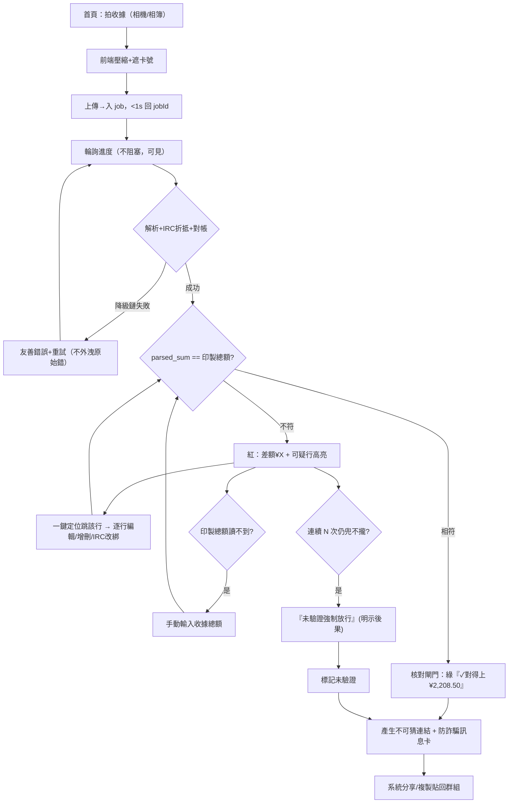

# UX Design Specification splitting_tools（Costco 分帳小工具）

**Author:** 長安
**Date:** 2026-05-18

---

<!-- UX design content will be appended sequentially through collaborative workflow steps -->

## Executive Summary

### Project Vision

個人/朋友共用的 Costco 收據拍照分帳小工具，非商業（永久無金流/帳本/
帳號/商業化）。UX 核心命題＝**降低分帳的動機與時機摩擦**，不是做更強
計算器：把整件事壓進「結帳完、人還在、記憶最新」的低摩擦窗口，
讓付款人「不必當會計」、朋友「點開就勾完」。兩面向單一連結貫穿：
付款人流（拍照→輪詢→核對閘門→出連結+訊息卡）、朋友流（開連結→
綁本機 token→認領/加權分攤→結算→貼回群組）。行動優先、單手、
賣場/車上情境設計。

### Target Users

- **付款人/發起人（主要）**：揪團刷卡墊全額者。痛點＝天書縮寫收據沒人
  想算、剩餘額怕被靜默坑。需求＝零苦工、金額一定對、剩餘額有意識掌握。
  情緒成功點＝解脫、沒當會計。
- **認領朋友（次要）**：被揪同行者。痛點＝裝 App/註冊/學習曲線。
  需求＝免註冊、點開 30 秒勾完、無需口頭解釋、敢點連結（非詐騙觀感）。
- 共同情境：手機單手操作、賣場/車上、網路可能不穩、趕時間、
  一般大眾非技術族。

### Key Design Challenges

就緒報告點名的 6 個高互動區（最易做壞，UX 必逐一攻）＋橫切：
1. **核對閘門**（FR8–16）：差額一鍵定位修正、可疑行抽檢呈現、
   「未驗證強制放行」措辭與後果可見性——付款人永不卡死、不誤信。
2. **認領看板**（FR47–49）：2–3s 輪詢更新須**視覺穩定不閃爍跳動**，
   誰加入/誰領了什麼/PENDING 一目了然。
3. **「是不是你」名單**（FR22–23）：免註冊下低摩擦選/改身份、不撞名。
4. **加權份額**（FR27–28）：A:5/B:3 手機單手輸入不出錯。
5. **付款人顯式吸收閘門**（FR39–40）：PENDING 橫幅 +「結束分帳並吸收
   剩餘」不可誤觸、不可靜默。
6. **防詐騙訊息卡**（FR18）：朋友敢不敢點的版面（採用成敗關鍵）。
- 橫切：單手可達熱區、樂觀更新感知<200ms、長收據縱向捲動+黏性小計、
  純文字結算一鍵複製貼回群組、賣場弱網的進度可見與降級提示。

### Design Opportunities

- **「✓ 對得上總計 ¥X」信任標示貫穿全程**：把正確性變成可見安心感，
  解掉收據分帳工具最大棄用點。
- **PENDING + 顯式吸收的社交壓力看板**：借 WeChat 群收款「誰已/未」
  狀態可見，收尾不靠人催、又無金流。
- **零守門即點即用**：對照 Splyt「強迫先邀朋友」反面教材，連結+訊息卡
  把朋友開啟摩擦降到最低。
- **賣場/車上「掃一眼就過關」核對**：可疑行抽檢 + 差額一鍵定位，
  目標付款人手動修正 ≤~3 項即過關。

## Core User Experience

### Defining Experience

兩條核心 loop 由單一連結貫穿，定義產品價值的關鍵互動有二：
- **付款人**：拍一張照 →（非阻塞 job，數秒）天書縮寫變看得懂明細 +
  IRC 自動折抵 + 底部「解析 ¥2,208.50 ✓ 對得上印製總額」→ 核對閘門
  掃一眼、可疑行抽檢、手動修正 ≤~3 項 → 一鍵出連結 + 訊息卡。
- **朋友**：開連結（免註冊、本機 token 自動記住）→「哪個是你」選身份
  → 逐行勾自己的（單品項可多人加權）→ 即時看到自己應付小計 →
  「我認領完了」→ 一鍵複製純文字貼回群。
單一最關鍵互動＝**認領勾選的即時小計回饋** ＋ **核對閘門掃一眼過關**。

### Platform Strategy

行動優先單頁 web app；iOS Safari + Android Chrome 近兩版為主，
桌面 evergreen 僅單欄置中「可用」（不做專屬版面）。純觸控、單手熱區。
相機路徑 `<input capture="environment">` + 相簿選圖。**無原生 App、
無離線模式**（v1 輪詢需連線）；賣場弱網以「前端壓縮 + 立即回 job_id +
進度可見 + 退避重試」吸收延遲，而非承諾秒數。技術載體 Next.js 16
App Router + Tailwind + TanStack Query（樂觀更新/2–3s 輪詢）。

### Effortless Interactions

- 免註冊即點即用：連結即入口，本機 token 自動綁身份、同團名字記憶。
- IRC 折扣自動配對母品項——使用者不需懂何謂 IRC。
- 自我對帳自動執行——平時不擋路，僅兜不攏時提示。
- 認領/改份額/小計樂觀更新，感知 < 200ms；輪詢回填不閃爍。
- 結算純文字一鍵複製，直接貼回既有群組（無需教學）。

### Critical Success Moments

- **付款人 Aha**：拍完照，天書變看得懂且「✓ 對得上 ¥2,208.50」。
- **朋友 Aha**：打開只要勾自己那幾樣、立刻看到應付數字。
- **Make-or-break（任一失敗即毀體驗）**：解析錯卻已分享（核對閘門擋）；
  未認領被靜默坑付款人（PENDING + 顯式吸收擋）；朋友不敢點連結
  （防詐騙訊息卡擋）；核對把付款人卡死在賣場（逃生口擋）。

### Experience Principles

1. **時機優先於計算**：每個畫面為「賣場/車上、單手、趕時間」而設計。
2. **正確性可見即信任**：「✓ 對得上總計」貫穿全程，不是隱形保證。
3. **零守門、零學習**：免註冊、即點即用、朋友端無需任何口頭解釋。
4. **永不卡死、永不靜默**：閘門恆有逃生口；剩餘額必須付款人顯式吸收。
5. **樂觀即時回饋**：勾選/份額/小計手感 < 200ms，輪詢回填視覺穩定。

## Desired Emotional Response

### Primary Emotional Goals

- **付款人核心情緒＝解脫**：被卸下「當會計」的心理重擔。不是「算得快」，
  是「我不必算」。
- **朋友核心情緒＝零負擔配合**：「就這樣？好，勾完了」——無學習、
  無被求助的尷尬。
- **共同底層＝信任**：金額一定對、沒人被靜默坑、這連結不是詐騙。
  信任是本產品的情緒地基，崩了其餘全崩。

### Emotional Journey Mapping

- **付款人**：面對天書收據的 dread → 拍照後「變懂了」的 relief →
  看到「✓ 對得上 ¥2,208.50」的 confidence → 出連結的掌控感 →
  結束的解脫。
- **朋友**：群組看到連結的一絲戒心（詐騙？）→ 訊息卡化解戒心 →
  開啟即懂的 ease → 勾完看到數字的「被公平對待」→ 貼回群的完成感。
- **出錯時（情緒目標＝不慌）**：對帳兜不攏 → 不焦慮（逃生口 + 指引在）；
  認錯人/競態 → 不慌（可改、伺服器權威顯示真實狀態）；遲到者 →
  不被當壞人（唯讀降級，明確知道找付款人線下處理）。
- **回訪**：熟悉、更快（同團名字記憶、本機 token 自動是我）。

### Micro-Emotions

關鍵正向（必達）：Trust＞Skepticism、Confidence＞Confusion、
Accomplishment＞Frustration、Calm＞Anxiety、Belonging＞Isolation
（朋友自助但看得到大家狀態）。
必避免：被坑感、被當會計的怨、詐騙戒心未解、卡死焦慮、
算錯錢的社交尷尬。

### Design Implications

- 信任 → 「✓ 對得上總計」標示貫穿全程；訊息卡防詐騙版面；
  未驗證橫幅誠實標示（不假裝沒事）。
- 解脫 → 天書秒變看得懂；IRC/對帳自動；付款人零逐行苦工。
- 平靜 → 逃生口永遠在畫面可見處；進度不阻塞可見；PENDING 顯式非靜默。
- 公平/被尊重 → 每人只能改自己的；加權份額精確；結算 Σ 精確對總。
- 零負擔配合 → 免註冊、即點即懂、純文字一鍵貼回群。

### Emotional Design Principles

1. **先卸重擔，再談功能**：第一個情緒勝點是「我不必當會計」。
2. **把正確性做成看得見的安心**：信任要顯式呈現，不是隱形保證。
3. **焦慮的反面是「永遠有下一步」**：任何卡點都給可見出路。
4. **公平靠精確 + 透明**：金額對得上 + 誰領了什麼看得到。
5. **朋友的第一情緒是戒心**：先用訊息卡化解，再請求任何動作。

## UX Pattern Analysis & Inspiration

### Inspiring Products Analysis

借成熟模式、非對標（使用者明令：這是方便小工具，非打市場產品）：
- **Tricount / Splid（零註冊連結）**：免帳號、開連結即用——零守門被一致
  讚賞。對應本專案「連結即入口 + 本機 token」。
- **Splitwise（by-shares 分攤）**：份數/權重心智成熟（A:5/B:3）；但逐項
  僅 0/50/100% + 付費牆。借其 shares 模型，棄其僵化與付費牆。
- **WeChat 群收款（狀態看板）**：「誰已付/未付」狀態可見＝業界對「催人
  收尾」唯一有效解，且不需金流。對應本專案 PENDING + 認領看板
  （v1 輪詢版，不需 websocket）。
- **Tab / Splyt（拍收據 tap-to-claim）**：拍收據逐行認領有先例（可行性
  佐證）；Splyt「強迫先邀朋友才能分」被罵爆＝關鍵反面教材。

### Transferable UX Patterns

- **免帳號連結入口**（Tricount）→ 朋友零守門即點即用。
- **by-shares 加權份額**（Splitwise）→ 整箱拿量 10:20＝shares 1:2，
  手機單手選份額。
- **狀態可見社交壓力看板**（WeChat）→ 誰加入/誰領了什麼/PENDING，
  收尾不靠人催。
- **tap-to-claim 逐行認領**（Tab）→ 勾選即認領 + 即時小計回饋。
- **極簡「誰欠誰」+ 一鍵複製純文字**（Tricount/Splid）→ 結算可直接
  貼回既有群組。

### Anti-Patterns to Avoid

- **強迫先邀朋友/先建群才能用**（Splyt 被罵爆）→ 違反零守門，禁。
- **逐項僅 0/50/100% + 付費牆**（Splitwise）→ 表達力不足且設障，禁。
- **裸 URL 丟群**（普遍）→ 觀感像詐騙、朋友不敢點 → 必用訊息卡。
- **未認領靜默歸付款人**（多數工具隱性 default）→ 坑付款人，
  改為 PENDING + 顯式吸收。
- **解析錯卻已分享**（OCR 類工具棄用主因）→ 核對閘門先擋。
- **真即時 websocket 看板**（過度工程）→ v1 輪詢即足，禁過早引入。

### Design Inspiration Strategy

**Adopt（直接採用）**：免帳號連結入口、tap-to-claim 逐行認領 +
即時小計、狀態可見看板、一鍵純文字結算——皆已被驗證且貼合核心體驗。
**Adapt（改造採用）**：Splitwise by-shares → 簡化為手機單手份額輸入；
WeChat 狀態看板 → 降級為 2–3s 輪詢、視覺穩定不閃爍；極簡結算 →
加「✓ 對得上總計」信任標示。
**Avoid（明確不做）**：強迫邀友守門、付費牆、裸 URL、靜默歸付款人、
真即時同步、debt-simplification 最少轉帳（v2，v1 不做）。

## Design System Foundation

### 1.1 Design System Choice

**Tailwind CSS（架構已鎖）+ shadcn/ui（Radix UI 原語 + Tailwind 樣式，
copy-in）。** 非 runtime 元件庫、非自訂設計系統——介於兩者：擁有
Radix 的無障礙行為原語，樣式以 Tailwind utility 完全可控、程式碼
copy 進 repo 自己擁有。

### Rationale for Selection

- **直接服務 NFR-A1**：Radix Dialog/Popover/ScrollArea 等內建鍵盤
  操作、焦點管理、ARIA——本專案 6 高互動區多為 modal/banner/list
  （核對閘門彈窗、PENDING 橫幅、份額調整、「是不是你」名單、
  訊息卡），自己手刻易做壞且難達「核心動作鍵盤可達」。
- **零 runtime bloat、極簡**：copy-in 無套件相依，只進你用到的元件，
  契合 n=1 與「用完即走小工具」反過度工程。
- **與既有決策零摩擦**：架構已選 Tailwind；shadcn/ui 原生 Tailwind v4
  + Next.js 16 + React 19，無雙軌風格衝突。
- **無品牌包袱**：非商業無視覺識別需求，採其中性預設即可，省設計工。

### Implementation Approach

- 以 shadcn CLI 初始化（Tailwind v4 `@theme`），僅按需 `add` 元件
  （dialog、sheet、popover、button、input、checkbox、badge、
  alert、scroll-area 等高互動區所需）。
- 元件 copy 進 `src/components/ui/`（架構結構模式內），feature 層
  （`src/features/*`）組合這些原語成業務元件。
- 中性 design tokens（OKLCH 色、間距、圓角）集中於 Tailwind theme，
  行動單手熱區尺寸（最小點擊區 ≥44px）寫入 token 規範。

### Customization Strategy

- 不做完整品牌化；只調：足夠對比色（NFR-A1）、行動最小點擊區、
  黏性小計/動作列、「✓ 對得上總計」信任標示與「未驗證」橫幅的
  語意色（成功/警示）。
- 高互動區互動行為沿用 Radix 原語預設（焦點鎖、ESC 關閉、
  scroll lock），不覆寫破壞無障礙。
- 輪詢更新採視覺穩定策略（既有列就地更新、不卸載重掛），
  避免 list 閃爍跳動（FR47–49 carry-forward）。

## 2. Core User Experience

### 2.1 Defining Experience

定義性互動＝**朋友開連結後「逐行勾自己的 → 即時看到我要付多少」**。
這是使用者對朋友的一句話描述：「開連結，把你拿的勾一勾，就知道付多少」。
其前置使其成立的體驗＝**付款人「拍張照 → 天書變看得懂且 ✓ 兜對
¥2,208.50 → 掃一眼核對 ≤3 項過關 → 出連結」**。
若這兩段無摩擦，整個產品的價值（時機 + 信任 + 零負擔）即成立。

### 2.2 User Mental Model

- 朋友的心智模型＝「**這是一張清單，我把屬於我的打勾**」（borrow
  購物清單/問卷勾選），非「記帳」非「轉帳」。預期：開即用、勾完看到
  數字、不必懂規則。易混點：整箱多人怎麼分（用「多人分 + 份額」化解，
  預設均分降低決策）。
- 付款人的心智模型＝「**我拍照，系統幫我把天書翻成人話並確認沒算錯**」，
  非「我來逐行打帳」。預期：少修幾項就過、有把握金額對得上。
- 現況替代方案：回家在群組當會計（沒人想做）或隨便均分（不公平）——
  兩者皆痛；本工具的心智賣點是「不必當會計，且金額看得出是對的」。

### 2.3 Success Criteria

- 朋友：開連結到「我認領完了」**無需任何口頭解釋**；勾選/改份額
  手感 < 200ms；任何時刻看得到「我目前應付 ¥X」。
- 付款人：手動修正 **≤ ~3 項**即過核對閘門；全程在賣場/車上單手完成。
- 共同：結算「✓ 對得上總計 ¥2,208.50」可見；零「未認領被靜默吃掉」。
- 成功訊號：朋友勾完即見數字並一鍵貼回群；付款人按吸收/結束是
  有意識的明確動作，不是系統替他默默決定。

### 2.4 Novel UX Patterns

**以成熟模式為主、單一微創新**：
- established（直接採用，零教育成本）：清單勾選認領（Tab）、
  by-shares 份額（Splitwise）、零註冊連結（Tricount）、狀態看板
  （WeChat 群收款）。
- 微創新（需極輕引導）：**「✓ 對得上總計」信任標示貫穿** ＋
  **PENDING + 付款人顯式吸收**取代靜默歸付款人——以熟悉隱喻包裝
  （像收據底部的「合計」打勾、像群收款的「未付名單」），不需教學頁。
- 結論：無需新互動語彙；創新在「正確性可見」與「不靜默坑人」的
  資訊呈現，而非操作手勢。

### 2.5 Experience Mechanics

**A. 朋友 tap-to-claim 定義性 loop**
1. Initiation：點訊息卡連結 → 免註冊直接進；若本機 token 已知身份，
   直接是「我」；否則「哪個是你？」名單一鍵選/新增。
2. Interaction：逐行清單，點該行＝認領/取消（toggle）；整箱點
   「多人分」→ 加入自己、預設均分、可拖/按 +- 改份額（A:5/B:3）。
3. Feedback：每次點擊樂觀更新 < 200ms；畫面黏性列恆顯「我應付 ¥X」
   即時變動；看板同步顯示誰已加入/各行誰領了/哪些 PENDING（2–3s
   輪詢、就地更新不閃爍）；他人競態回填以伺服器為準、不覆寫我的。
4. Completion：按「我認領完了」→ 結算頁見「我 ¥X ✓ 對得上總計」
   → 一鍵複製純文字貼回群。可隨時回來改（定案前）。

**B. 付款人前置使能體驗**
1. Initiation：首頁一顆大鈕「拍收據」（相機 capture / 相簿）。
2. Interaction：前端壓縮+遮卡號 → 立即回 job、顯示進度（不阻塞）→
   數秒後逐行明細、IRC 已折抵、底部對帳結果。
3. Feedback：對帳相符＝綠「✓ 對得上 ¥2,208.50」；不符＝紅 + 差額
   數字 + 可疑行高亮，**一鍵定位**跳到該行修正；總計糊掉可手動輸入；
   連續兜不攏出現「未驗證強制放行」（明示後果：所有人見未驗證橫幅）。
   永不卡死——畫面恆有可前進按鈕。
4. Completion：核對通過 → 「產生連結」→ 拿到不可猜連結 + 防詐騙
   訊息卡（日期/總額/品項數/付款人）→ 系統分享/複製貼群。

## Visual Design Foundation

### Color System

無品牌、機能優先；色彩語意由「正確性可見」情緒目標驅動，落在
Tailwind/shadcn theme（OKLCH）：
- **Neutral 基底**：近白底 + 深灰文字，長收據清單低視覺噪音。
- **Success（信任）**：綠——「✓ 對得上總計 ¥X」、對帳通過。產品最關鍵
  正向訊號，全程貫穿。
- **Warning（注意非錯誤）**：琥珀——可疑行高亮、「未經對帳驗證」橫幅。
  傳達「需你看一眼」而非「壞了」。
- **Danger（差額/失敗）**：紅——對帳差額數字、破壞性動作（刪行）。
- **Pending（中性待辦）**：灰／虛線——未認領品項、PENDING 看板狀態，
  刻意低調但可見（非錯誤色，避免製造焦慮）。
- **Accent（主要動作）**：單一品牌中性主色，用於「拍收據」「產生連結」
  「我認領完了」「結束分帳並吸收剩餘」等關鍵 CTA。
- 對比一律達 NFR-A1 足夠對比（正文 ≥ 4.5:1），不追 WCAG AA 形式認證。

### Typography System

- **字體**：系統字體堆疊（-apple-system / Segoe / Roboto…），零字體
  下載＝賣場弱網最快、無品牌字需求。
- **數字**：金額一律 `font-variant-numeric: tabular-nums`，逐行金額/
  小計/總計對齊不跳動（金錢工具關鍵可讀性）。
- **型階（行動優先精簡）**：H1 頁標題、H2 區段、Body 16px（行動最小
  舒適閱讀）、Caption 用於縮寫原文/輔助說明、Mono-ish 數字行。
- 行高寬鬆利於單手捲長收據；可點文字與純說明文字明確區分。

### Spacing & Layout Foundation

- **單位**：8px 基準（4px 細調），shadcn/Tailwind spacing scale。
- **版式**：行動單欄優先；長收據逐行清單縱向捲動；**黏性頂部**＝
  「我應付 ¥X」即時小計，**黏性底部**＝主要 CTA/動作列（單手拇指可達）。
- **點擊區**：互動列/勾選/份額 +- ≥ 44×44px；相鄰可點目標留足間距
  防誤觸（FR40「結束並吸收」尤須與其他鈕拉開、二次確認）。
- **桌面**：單欄置中（max-width 約手機寬），不做專屬多欄版面。
- 看板/清單更新就地、保留捲動位置，不重排不閃爍（FR47–49）。

### Accessibility Considerations

NFR-A1 務實基本級（不設 WCAG AA 正式目標）：語意化 HTML；
足夠色彩對比；色彩不單獨承載意義（✓/⚠ 圖示 + 文字並用，
色盲可辨）；核心動作鍵盤可達（沿用 Radix 原語焦點/鍵盤）；
行動單手熱區；表單錯誤文字明確（非僅紅框）。

## Design Direction Decision

### Design Directions Explored

於 `ux-design-directions.html` 探索 5 個方向（皆共用已鎖視覺基礎，
差異僅在資訊密度 × 看板整合方式 × 小計呈現三軸）：
A 清單優先·頂部黏性小計｜B 卡片·底部摘要抽屜｜C 分段 Tab 全部/我的｜
D 看板內嵌清單｜E 極簡聚焦一次一決策。聚焦定義性畫面（朋友逐行
認領 + 即時小計 + 看板），情境資料取自真實 #5564。

### Chosen Direction

**D 看板內嵌清單為基底，疊加 A 的頂部黏性小計、C 的「未認領」快速篩選。**
- D：每行直接顯示認領者 chip，看板「織入」清單、與認領同畫面；
  2–3s 輪詢就地更新該行 chip，**不重排、不卸載重掛、不閃爍**。
- A：頂部黏性常駐「我目前應付 ¥X」＋「✓ 對得上總計 ¥2,208.50」
  信任標示（已於視覺基礎鎖定的黏性小計）。
- C：提供「未認領」快速篩選入口（非獨立 Tab 主架構），讓付款人/
  認領者一鍵聚焦 PENDING，不打散 D 的單一清單心智。

### Design Rationale

- **最貼合定義性體驗**：勾選 + 即時小計 + 看板三者同畫面，朋友
  「勾一勾就知道付多少、也看得到別人狀態」無需切畫面。
- **直接命中 FR47–49 carry-forward**：看板與認領同列、輪詢就地更新
  ＝就緒報告點名「視覺穩定不閃爍跳動」的最佳結構解。
- **社交壓力即時可見**（借 WeChat 群收款）：誰領了什麼/誰沒領同列
  呈現，收尾不靠人催；PENDING 同清單斜線+標籤，付款人一鍵篩選聚焦。
- **與已鎖約束零摩擦**：行動單欄、shadcn/Radix、語意色、tabular-nums、
  ≥44px、頂/底黏性——全部沿用 step-06/08 決策，無新增矛盾。
- 不選 B/E：看板被藏或需另開，狀態可見性弱，違反 carry-forward；
  不選純 C：Tab 切換打散長收據單一掃視心智。

### Implementation Approach

- 單一清單元件（shadcn scroll-area + Radix），每行＝勾選 toggle +
  品名/縮寫原文 + 認領者 chips + 含稅金額（tabular-nums）；多人分攤
  行顯示份額（美:1/哲:1）。
- 頂部黏性：應付小計 + 信任標示（成功綠／未通過時警示色 + 差額）。
- 底部黏性：主要 CTA（「我認領完了」／付款人側「結束分帳並吸收剩餘」）。
- 輪詢更新策略：以穩定 key 就地 diff 更新行內 chip 與狀態，保留捲動
  位置，TanStack Query `refetchInterval` 2–3s、樂觀 `onMutate`。
- 「未認領」篩選＝清單上方輕量 filter chip（全部／我的／未認領），
  非破壞單一清單結構。
- 同一清單元件付款人核對閘門複用（加可疑行高亮、差額一鍵定位、
  逐行編輯態），降低元件分裂。

## User Journey Flows

### Journey 1+2｜付款人：拍照 → 核對閘門 → 出連結（含逃生口）

對應 PRD J1/J2。關鍵：核對閘門恆有前進路徑、永不卡死（FR16/NFR-R2）。



### Journey 3+4｜朋友：開連結 → 認領 → 結算（含認錯人/競態/遲到/PENDING）

對應 PRD J3/J4。看板與認領同畫面（方向 D）；每人只改自己 token 綁定。

```mermaid
flowchart TD
  F0["點訊息卡連結"] --> F1{"本機 token 已知身份?"}
  F1 -->|是| F3["直接是『我』"]
  F1 -->|否| F2["『哪個是你?』名單：選/新增"]
  F2 --> F3
  F3 --> F4["看板內嵌清單：逐行勾自己的"]
  F4 --> F5{"整箱多人分?"}
  F5 -->|是| F6["加入自己→預設均分→可改份額 A:5/B:3"]
  F5 -->|否| F7["toggle 認領/取消"]
  F6 --> F8["樂觀更新<200ms；頂部黏性『我應付¥X』"]
  F7 --> F8
  F8 --> F9["2–3s 輪詢就地回填；競態以伺服器為準不覆寫我的"]
  F9 --> F10{"選錯身份?"}
  F10 -->|是| F11["改選正確身份（僅限我 token 的認領）"] --> F4
  F10 -->|否| F12["按『我認領完了』"]
  F12 --> S0["結算頁：我¥X『✓對得上總計』+收據縮圖"]
  S0 --> S1["一鍵複製純文字貼回群"]
  F4 -.遲到且已定案.-> LT["唯讀結算 + 『已結清』；找付款人線下"]

  PB["付款人結算頁：常駐『N項/¥Z 未認領』橫幅"] --> PB1{"主動按『結束分帳並吸收剩餘』?"}
  PB1 -->|未按| PB
  PB1 -->|按下(二次確認)| PB2["定案→session 凍結唯讀（不超時/不靜默）"]
```

### Journey Patterns

- **導航**：單一連結貫穿、無多層選單；付款人/朋友流以連結 ID 下的
  路由切分（核對 / 認領 / 結算）。
- **決策**：每個 gate 恆有可前進按鈕（核對逃生口、PENDING 顯式吸收）；
  破壞性/定案動作（強制放行、結束吸收）一律二次確認 + 明示後果。
- **回饋**：操作即時樂觀（<200ms）→ 輪詢就地回填校正（不閃爍）→
  關鍵狀態以「✓/⚠ 圖示+文字+語意色」三重編碼（色盲可辨）。
- **身份/權限**：token 綁定，UI 僅暴露「我可改的」；他人狀態唯讀可見。

### Flow Optimization Principles

- **最短抵達價值**：朋友 0 註冊、token 已知則跳過身份步直接認領。
- **降低認知負荷**：多人分攤預設均分（少一個決策）；可疑行才高亮、
  平時不擋路；「未認領」一鍵篩選聚焦。
- **錯誤優雅復原**：解析失敗走降級鏈+友善訊息+重試；對帳不符一鍵
  定位修正；認錯人可改；競態顯示真實狀態而非報錯。
- **永不終局陷阱**：付款人永不被卡死；遲到者唯讀降級而非看到錯誤；
  剩餘額永遠顯式吸收、絕不靜默。

## Component Strategy

### Design System Components

shadcn/ui（Radix）直接覆蓋的基礎元件（copy-in，按需 add）：
Button、Checkbox/Toggle、Input、Dialog、Sheet（底部抽屜）、Popover、
Badge、Alert、Scroll-Area、Separator、Skeleton（載入）、Tooltip。
這些提供鍵盤/焦點/ARIA（NFR-A1 務實基本級無須自造）。

**Gap（需自訂組合，shadcn 無現成）**：收據逐行認領列、頂部信任小計列、
核對閘門、加權份額控制、身份名單、付款人吸收閘門、防詐騙訊息卡、
解析進度、純文字匯出、未驗證橫幅。

### Custom Components

**ReceiptLineRow（基石，最高複用）**
- Purpose：逐行認領/檢視的單一列，方向 D 看板內嵌的核心。
- Content：勾選態、品名+縮寫原文、認領者 chips、含稅金額(tabular-nums)、
  多人份額(美:1/哲:1)。
- Variants：`claim`（朋友認領）/`review`（付款人核對：可疑行高亮、
  逐行編輯、IRC 改綁）/`pending`（斜線+「沒人領」）/`readonly`（定案後）。
- States：default / claimed / multi-claim / suspicious / editing / pending /
  optimistic-syncing / disabled(凍結)。
- A11y：列為 listitem，勾選 Radix Checkbox 鍵盤可達，狀態文字+圖示+
  色三重編碼。**核對閘門與認領看板共用此元件**（降元件分裂）。

**StickySubtotalBar（頂部黏性）**
- Purpose：恆顯「我應付 ¥X」+ 信任標示。
- States：`verified`(綠 ✓對得上¥2,208.50) / `mismatch`(紅 差額¥X) /
  `unverified`(琥珀 未經對帳驗證)。金額 tabular-nums，輪詢就地更新不跳動。

**ReconciliationGate（組合元件）**
- 差額橫幅 + 可疑行高亮 + 一鍵定位跳行 + 逃生口（手動輸入總額 Input、
  「未驗證強制放行」需 Dialog 二次確認+明示後果）。恆有可前進按鈕。

**WeightedShareControl**
- A:5/B:3 單手 stepper；預設均分；每認領者 +/- ≥44px；即時重算小計。

**IdentityPicker**
- 「哪個是你」名單（Sheet/Dialog）：選既有/新增；device-token 綁定；
  可改選（僅限我 token）。同團名字 localStorage 記憶。

**PayerAbsorbGate**
- 常駐「N 項/¥Z 未認領」橫幅 + 「結束分帳並吸收剩餘」鈕：與其他鈕
  拉開、Dialog 二次確認、明示後果；不可誤觸、不可靜默、無超時。

**MessageCard**
- 防詐騙分享卡（日期/總額/品項數/付款人，非裸 URL）+ 系統分享/複製。

**ParseProgress**
- 非阻塞 job 進度：queued/processing/succeeded/failed/degraded；
  失敗走友善訊息+重試（不外洩原始錯）。

**UnverifiedBanner**
- 「未經對帳驗證」橫幅，向所有認領者頁傳播（FR15）。

**PlaintextSettlementExport**
- 純文字結算區塊 + 一鍵複製（貼回群組）。

### Component Implementation Strategy

- 全部自訂元件建於 shadcn 原語 + Tailwind design tokens（step-08），
  不引入額外 UI runtime。
- **ReceiptLineRow 為單一事實來源**：認領看板、核對閘門、結算唯讀
  皆以其 variant 複用，禁各畫面另造列元件。
- 輪詢更新：穩定 key 就地 diff，保留捲動位置，不卸載重掛（FR47–49）。
- 互動行為沿用 Radix 預設（焦點鎖/ESC/scroll-lock），不覆寫破壞 a11y。
- 對應架構 `src/components/ui/`（shadcn copy-in）與 `src/features/*`
  （業務組合），與 architecture.md 結構零摩擦。

### Implementation Roadmap

對齊 architecture Implementation Sequence（解析→核對→連結→
身份/認領/看板→結算），不倒置：
- **Phase 1 核心**：ParseProgress、ReceiptLineRow（claim/review）、
  StickySubtotalBar、ReconciliationGate（含逃生口）。
- **Phase 2 支援**：IdentityPicker、ClaimerChips（內嵌看板）、
  WeightedShareControl、UnverifiedBanner。
- **Phase 3 收尾**：MessageCard、PayerAbsorbGate、
  PlaintextSettlementExport、readonly 降級態。

## UX Consistency Patterns

### Button Hierarchy

- **Primary（每屏至多 1）**：底部黏性 CTA，accent 實心、滿寬、≥48px——
  「拍收據」「我認領完了」「產生連結」。
- **Destructive/定案（高摩擦）**：「未驗證強制放行」「結束分帳並吸收
  剩餘」「刪除行」——危險語意色、與其他鈕拉開、**必經 Dialog 二次確認
  + 明示後果**，禁與 Primary 相鄰防誤觸。
- **Secondary**：外框/淺底（「手動輸入總額」「改選身份」「復原」）。
- **Tertiary/inline**：文字鈕（「一鍵定位」「undo」），列內輕量。
- 規則：一屏單一主要動作；危險動作永不靜默、永不一鍵不可逆。

### Feedback Patterns

- **三重編碼**：所有狀態＝色 + 圖示 + 文字（色盲可辨，NFR-A1）。
  成功綠 ✓、警示琥珀 ⚠、危險紅 ✗、待辦中性灰虛線。
- **信任回饋**：對帳通過＝StickySubtotalBar 綠「✓對得上¥2,208.50」；
  不符＝紅 + 具體差額數字（非僅「錯誤」）。
- **樂觀回饋**：操作 <200ms 立即反映 → 輪詢就地校正；衝突不報錯，
  改以伺服器權威狀態靜默修正並於該行短暫高亮提示。
- **錯誤**：LLM/系統錯永不外洩原始訊息 → 友善繁中 + 可行下一步
  （重試/逃生口），絕不死路。
- Toast 僅用於非阻斷確認（「已複製」）；阻斷性決策用 Dialog 不用 toast。

### Form Patterns

- 行內編輯優先（核對閘門逐行就地改），非跳獨立表單頁。
- 即時驗證（Zod 邊界），錯誤以**文字**描述於欄位下（非僅紅框）。
- 數字輸入（金額/份額）：數字鍵盤、tabular-nums、防呆（份額 ≥0、
  總額格式）。手動輸入總額為帶單位提示的單一聚焦 Input。
- 鍵盤彈出時黏性 CTA 不被遮（避開鍵盤）。

### Navigation Patterns

- 單一連結貫穿，無多層選單/漢堡。路由＝連結 ID 下三態：核對 /
  認領+看板 / 結算。
- 線性前進為主；返回不破壞已存狀態（認領即存、可回改至定案前）。
- 「未認領」為清單上方輕量 filter chip（全部/我的/未認領），非分頁跳轉。
- 定案後全站降級唯讀，導覽仍可瀏覽但所有寫入入口消失（非報錯）。

### Additional Patterns

- **載入**：解析走 ParseProgress 進度（非轉圈黑箱）；清單初載
  Skeleton（不位移跳動）。
- **空狀態**：尚無人加入看板＝中性引導文案（非錯誤感）；無 PENDING＝
  正向「全部已認領 ✓」。
- **輪詢更新**：穩定 key 就地 diff、保留捲動位置、變更行短暫柔和高亮，
  全程不重排不閃爍（FR47–49 carry-forward 核心規範）。
- **唯讀降級**：定案/遲到者＝整頁唯讀態 + 明確「已結清」標示 +
  引導（找付款人線下），非 disabled 灰畫面。
- **分享**：一律 MessageCard（防詐騙），禁裸 URL；系統分享優先、
  退化為複製。
- 所有 modal/overlay 用 Radix（焦點鎖、ESC、scroll-lock），不自造。

## Responsive Design & Accessibility

### Responsive Strategy

- **Mobile（主要，設計起點）**：行動單欄；長收據縱向捲動 + 頂部黏性
  小計/信任標示 + 底部黏性 CTA；單手拇指熱區；相機 capture/相簿。
  所有決策以此為第一公民。
- **Tablet**：沿用單欄、加大留白與字級即可，不另設計版面。
- **Desktop（次要，僅需可用）**：單欄置中（max-width ≈ 手機寬），
  **刻意不利用額外橫向空間**（無多欄/側欄）——非商業小工具，桌面
  只需「能用」，避免為桌面分裂版面增加 n=1 維護面。

### Breakpoint Strategy

- **Mobile-first media queries**（Tailwind 預設斷點，min-width 累加）。
- 實務上僅一個有意義轉折：超過內容容器寬即置中留白，內部佈局不變。
- 不為桌面做專屬斷點重排（與 PRD「桌面僅需可用」一致）。

### Accessibility Strategy

- **目標＝NFR-A1 務實基本級（pragmatic baseline）；明確不設 WCAG AA
  正式合規目標（NFR-A2）**——非商業小工具、領域 general/low、無合規
  要求，過度工程排除（此為 PRD 既定決策，非本步驟新增）。
- 落實項：語意化 HTML；正文對比 ≥ 4.5:1；狀態三重編碼（色+圖示+文字，
  色盲可辨）；核心動作鍵盤可達（沿用 shadcn/Radix 焦點/鍵盤/ARIA）；
  觸控目標 ≥ 44×44px；焦點可見；表單錯誤文字化；modal 焦點鎖/ESC。
- 不追求：完整螢幕報讀器逐頁優化、AAA、跳過連結等 AA/AAA 形式項。

### Testing Strategy（與規模相稱，不過度）

- **響應式**：真機 iOS Safari + Android Chrome（主要情境）；桌面
  evergreen 抽測單欄不破版；弱網模擬驗證解析非阻塞 + 進度可見。
- **無障礙（基本級）**：鍵盤 only 走核心流程（拍照→核對→認領→結算）；
  色彩對比工具檢查語意色；色盲模擬檢查狀態三重編碼成立。
- **不納入**：螢幕報讀器矩陣、找障礙使用者測試——超出非商業 n=1
  小工具範圍（明示取捨，非遺漏）。
- 關鍵正確性回歸（`parsed_sum==2208.50`、`settlement_sum==parsed_sum`）
  屬架構 CI，非 UX 測試範圍但為信任標示前置。

### Implementation Guidelines

- 相對單位（rem/%/vw）+ Tailwind spacing token；避免固定 px 版面。
- Mobile-first 撰寫；黏性頂/底列用 safe-area inset（瀏海/Home 指示）。
- 鍵盤彈出不遮黏性 CTA；數字輸入用 `inputmode=decimal`。
- 影像前端壓縮至長邊 ~1600px 再上傳（效能 + 弱網）。
- 語意 HTML + 沿用 Radix ARIA，不自造 overlay；狀態勿僅靠顏色。
- 與架構 NFR-A1/A2、效能門檻一致，下游 epic 不得擅自升級為 AA 目標。
